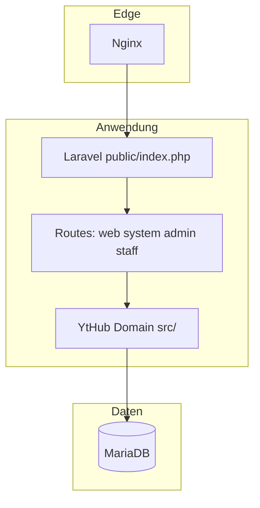

# YT Channel Hub — Präsentationsbrief & Tech-Sheet

**Zweck:** Material für Folien, Demos oder eine andere KI (Struktur, Fakten, Lücken, Prompts).  
**Paketname (Composer):** `yt-channel-hub/local`  
**Kurzbeschreibung:** Multi-Channel-YouTube-Frontend mit Analytics-Backend (self-hosted).

---

## 0. Drei Sätze für den Einstieg (DE)

Self-hosted Web-App: mehrere YouTube-Kanäle auf einer öffentlichen Startseite, Metadaten- und Analytics-Daten in **MariaDB**, **Admin** für Kanäle/Jobs/Exporte, **Mitarbeiter** mit eingeschränkten Rechten (Upload, Umsatz lesen). **Laravel** liefert Routing und Blade-UI; Geschäftslogik liegt in **PHP** unter dem Namespace **`YtHub\`** (`src/`). **Social-Crossposting** (X, TikTok, Meta, LinkedIn) ist vorbereitet; X-Text-Posts funktionieren, Video-Upload folgt. **MRSS-Feed-Modul** liefert Video-Kataloge pro Kanal an FAST-Plattformen (Pluto TV, Samsung TV Plus, Rakuten TV u. a.).

**One-liner (EN):** Self-hosted multi-channel YouTube hub with MariaDB analytics, admin + staff roles, Laravel front layer, a shared `YtHub` domain layer, MRSS feeds for FAST channel providers, and social cross-posting (X text posts live, video upload pending).

---

## 1. Zielgruppen & Botschaften

| Zielgruppe | Kernbotschaft |
|------------|----------------|
| **Geschäft / Marketing** | Eine Installation, viele Kanäle; Kennzahlen und Exporte; keine Abhängigkeit von SaaS-Analytics für die Basis. |
| **IT / Betrieb** | Docker, Health-Check, Warteschlangen, Installer; Daten bleiben auf eigener Infrastruktur. |
| **Redaktion** | Staff-Login nur für freigegebene Kanäle; Upload mit Metadaten; keine Admin-Vollrechte nötig. |

---

## 2. Funktionsübersicht (Ist-Zustand)

### Öffentliche Site
- **Startseite** `/` und **`/index.php`** — mehrkanalige Video-Übersicht, Sprache, SEO-Grundgerüst (Blade).
- **Rechtstexte** — `/datenschutz.php`, `/impressum.php` (Blade).
- **Backend** `/backend.php` — Zugriff per internem Token, Cookie oder Admin-Session; KPIs nach Zeitraum, Kanal-Tabelle, **YouTube-Upload** inkl. erweiterter Metadaten (Untertitel, Lokalisierungen, Kategorie).

### Admin (`/admin/*.php`, Laravel)
- **Login / Logout** (Passwort-Hash in `config/config.php`).
- **Dashboard** — Kanäle, Job-Buttons (Video-Sync gesamt/pro Kanal, Analytics-Sync), letzte Queue-Einträge.
- **Kanäle** — anlegen, bearbeiten, löschen; **Google OAuth** pro Kanal (`/oauth_start.php`).
- **Analytics** — Zeitraumfilter, KPIs, **CSV-Export** (Excel- oder SAP-orientiertes Format).
- **Logs** — Ausschnitt aus `storage/logs/app.log` (Größenlimit).
- **Mitarbeiter** — anlegen/löschen; Module (Upload, Videos bearbeiten, Umsatz); Kanal-Zugriff allow/block/blockiert.
- **API Keys** — `/admin/api-keys?token=…`: TMDB- und Google-API-Schlüssel verschlüsselt in der Datenbank hinterlegen (DB-Werte haben Vorrang vor `.env`-Einträgen).
- **Social (nur Vorbereitung)** — `/admin/social/*` mit **internem Token** (ohne Laravel-CSRF): Aktivierung, Settings, Accounts-, Posts-UI — **kein** vollständiger Connect/Post-Flow für alle Netzwerke.

### Staff (`/staff/*.php`, Laravel)
- Eigener Login, **Start**, **Upload** (mit Modul), **Videos** (Cache-Liste + YouTube-Link), **Umsatz** (mit Modul, Zeitraum).

### MRSS Feeds (FAST-Plattformen)
- **`/feed/mrss`** — Index aller aktiven Kanäle als RSS mit Feed-URLs.
- **`/feed/mrss/{slug}`** — MRSS-Feed pro Kanal; FAST-Provider (Pluto TV, Samsung TV Plus, Rakuten TV etc.) pollt diese URL.
  - `media:content` (YouTube-URL, Typ, Dauer), `media:title`, `media:description`, `media:thumbnail`, `media:category`, `dcterms:valid`.
  - Query-Parameter `?limit=N` (Standard 200, Max 500).
  - Cache-Header: `max-age=900`, `s-maxage=1800`.
- **Admin-Seite** `/admin/mrss-feeds?token=…` — Übersicht aller Kanäle mit Feed-URL, Kopieren-Button, XML-Vorschau-Link, Übergabe-Anleitung.

### Advanced Feeds (Kuratiert + TMDB)
- **`/feed/advanced/{slug}`** — MRSS-Feed mit **nur ausgewählten Videos** eines Kanals; ideal für kuratierte FAST-Kataloge.
- **TMDB-Anreicherung** (optional): Titel und Beschreibung aus TMDB in der Feed-Sprache (z. B. DE, EN, FR) holen; Poster als Thumbnail. TMDB-ID als `media:category` im Feed.
- **Priorität** Titel/Beschreibung: Custom-Überschreibung > TMDB > YouTube-Original.
- **Admin-UI** `/admin/advanced-feeds?token=…`:
  - Feed anlegen: Kanal wählen, Sprache, TMDB an/aus.
  - Videos aus dem Kanal-Katalog per ID hinzufügen/entfernen, Reihenfolge.
  - TMDB-Suche inline (multi-search: Film + Serie), Ergebnis einem Video zuweisen → Titel/Beschreibung/Poster werden automatisch in der gewählten Sprache geladen.
  - TMDB-Daten pro Item löschen oder überschreiben.
- **DB:** `advanced_feeds` (slug, channel, Sprache, TMDB-Flag), `advanced_feed_items` (Video-ID, Sort, TMDB-Felder, Custom-Felder).
- **TMDB API Key** im Admin (`/admin/api-keys`) oder in `.env` setzen; ohne Key funktioniert alles außer der TMDB-Anreicherung.

### System & Automation
- **`/health.php`** — Liveness; mit Token erweiterte Checks (DB, Logs-Verzeichnis).
- **Sync** — `/sync_videos.php`, `/sync_analytics.php` (HTTP: Token oder Admin); CLI: `bin/sync_*.php`, `bin/worker.php`.
- **`/oauth_callback.php`** — Refresh-Token speichern (optional verschlüsselt).
- **`/install.php`** — Web-Installer (MariaDB / Plesk-tauglich).
- **Queues** — Domain-Jobs über `bin/worker.php`; Laravel **`database`-Queue** für Social-Jobs, Service `laravel-queue` in Docker.
- **Laravel Scheduler** — `queue:work` (mit `--max-time`, `--stop-when-empty`, `withoutOverlapping`), `queue:prune-failed`, `queue:prune-batches` — täglich bzw. minütlich via `* * * * * php artisan schedule:run`.

### Deployment & Betrieb
- **Plesk** (primär): Vollständige Anleitung in `deploy/PLESK_DEPLOY.md`; idempotentes Deploy-Skript `deploy/plesk-deploy.sh`; Nginx-Snippets unter `deploy/`.
- **Docker**: `docker-compose.yml` mit Services nginx, php (Health-Check), laravel-queue, worker, db (MariaDB 11). Secrets per `.env`-Datei parametrisiert.
- **PHP**: ^8.4 (8.5-kompatibel, `Pdo\Mysql`-Guard in `config/database.php`).
- **Logging**: Standard `daily` (Log-Rotation), `LOG_LEVEL=warning` in Produktion.
- **HTTPS**: `URL::forceScheme('https')` in Produktion; TrustProxies für Plesk-Nginx → PHP-FPM; `SESSION_SECURE_COOKIE=true`.

### Internationalisierung
- Kataloge unter `src/lang/` (u. a. DE, EN, FR, TH); `YtHub\Lang` in Blade und Domain.

---

## 3. Technisches Datenblatt

### Stack (Versionen bitte bei Release gegen `composer.json` prüfen)

| Komponente | Version / Hinweis |
|------------|-------------------|
| **Laravel** | 13.x (`laravel/composer.json`, PHP **^8.4**, 8.5-kompatibel) |
| **Domain-Paket (Root)** | PHP **^8.4**; PSR-4 `YtHub\` → `src/` |
| **Datenbank** | MariaDB / MySQL, Schema + Migrationen in `database/` |
| **Google** | `google/apiclient` ^2.15 — YouTube Data, Analytics, OAuth2 offline |
| **Logging** | Monolog; App-Log u. a. unter `storage/logs/` |
| **Frontend** | Blade; CSS/JS unter `public/assets/` (Symlink `laravel/public/assets` → `../../public/assets`) |
| **Tests** | PHPUnit; Feature-Smoke für öffentliche/Admin-Routen ohne DB-Schreiben (siehe Abschnitt 4) |

### Architektur (Mermaid)



### Routing-Reihenfolge (vereinfacht)

1. `routes/web.php` — `/`, `/index.php`, Legal, Social (mit Prefix), OAuth-Start/Callback.  
2. `routes/system.php` — Health, Sync, OAuth, Install, Backend, **MRSS-Feeds** (`/feed/mrss`, `/feed/mrss/{slug}`).  
3. `routes/admin.php` — Admin-Blade-Routen inkl. **MRSS-Feed-Übersicht**.  
4. `routes/staff.php` — Staff inkl. statische `upload-loc.js`.  
5. `routes/legacy.php` — Catch-All **LegacyBridge** (nur wenn passende `public/**/*.php` existiert; aktuell **keine** PHP-Dateien mehr unter `public/`).

### Sicherheit & Auth (wichtig für Folien)

- **Admin / Staff:** eigene PHP-Sessions (`yt_hub_sid`, `yt_hub_staff`); parallel Laravel-Session für Framework — **Hybrid**, kein Laravel Breeze/Fortify.
- **Interner Token** für Cron/Sync/Health-Tiefgang (`INTERNAL_TOKEN` / Config).
- **CSRF** auf Admin/Staff-Formularen über `YtHub\Csrf` / `StaffCsrf` (nicht überall Laravel `@csrf`).
- **Social-Admin:** Route-Gruppe mit Middleware `internal.token`, Laravel-CSRF deaktiviert für diese Gruppe.

### Verzeichnisüberblick

```
src/                 YtHub — DB, Sync, Auth, Google, Export, Upload
public/assets/     CSS/JS; public/staff/upload-loc.js
laravel/           Laravel — routes, app/, resources/views
config/            u. a. config.php (Installer), legal.php
database/          schema.sql, migrations
bin/               worker, sync_*, migrate, backup
deploy/            plesk-deploy.sh, PLESK_DEPLOY.md, nginx-*.conf, .env.plesk.example
docker/            nginx default.conf, README
```

---

## 4. Lücken & Roadmap (ehrlich für Stakeholder)

| Thema | Status |
|--------|--------|
| **Social Posting** (X, TikTok, Meta, LinkedIn) | X: OAuth Connect + **Text-/Link-Tweets live** (inkl. Token-Refresh); TikTok: OAuth Connect live, Publisher **Stub** (App Review nötig); Meta/Facebook/LinkedIn: nur Settings + Keys. Video-Upload via X Media-API noch nicht angebunden. |
| **MRSS / FAST** | Einfache Feeds + **Advanced Feeds** (kuratiert + TMDB) produktionsbereit. Für echten Ingest bei Providern ggf. Lizenz-/Rechte-Metadaten (`dcterms:license`, `media:rights`) ergänzen. |
| **Tests** | **Smoke:** `/up`, `/health.php` (Liveness), Legal, `upload-loc.js`, Admin-Login-GET (`laravel/tests/Feature/HttpRoutesTest.php`); `TestCase` setzt `APP_BASE_PATH` wegen gemeinsamer Root-`vendor` mit YtHub. **Fehlt noch:** DB-abhängige Flows (Home `/`, Sync, OAuth, Staff-POST). |
| **Auth vereinheitlichen** | Optional: alles über Laravel Guard / eine Session / Passwort-Reset / 2FA. |
| **Legacy-Bridge** | Technisch noch registriert; ohne `public/**/*.php` praktisch nur noch Fallback-404. |
| **Staff „Videos“** | Anzeige aus Cache; **kein** YouTube-Metadaten-Editor in der App. |

---

## 5. Folien-Vorschlag (15 Folien)

1. Titel + Untertitel (self-hosted, Multi-Channel).  
2. Problem: viele Kanäle, verteilte Insights.  
3. Lösung in einem Satz (Hub + DB + Rollen).  
4. Öffentliche Site + Backend-Upload (Screenshot-Platzhalter).  
5. Admin: Kanäle, Jobs, Analytics, Export.  
6. Staff: eingeschränkter Zugriff (Trust-Story).  
7. Technik-Stack (Tabelle aus Abschnitt 3).  
8. Architekturdiagramm (Mermaid exportieren oder neu zeichnen).  
9. Sicherheit & Datenhoheit.  
10. Betrieb: Plesk-Deploy, Docker, Health, Queues, Scheduler.  
11. MRSS-Feeds für FAST-Plattformen (einfach + kuratiert).  
12. Advanced Feeds: TMDB-Anreicherung, Sprachauswahl (Demo-Folie).  
13. Admin: API-Key-Verwaltung, Social Settings (DB-verschlüsselt).  
14. Roadmap: Social fertigstellen, Tests, Auth.  
15. Q&A / Kontakt.

---

## 6. Prompts für andere KI(en)

### 6a Deutsch — Präsentation

```
Du erstellst eine professionelle Präsentation (10–14 Folien) für ein gemischtes Publikum (Produkt + Technik).

Produkt: „YT Channel Hub“ — self-hosted Web-Anwendung für mehrere YouTube-Kanäle mit MariaDB-Analytics,
Admin-Oberfläche (Kanäle, Jobs, Exporte, Logs, Mitarbeiterverwaltung), Staff-Bereich (Upload, Videos-Liste, Umsatz),
Laravel als Web-Schicht, Geschäftslogik im PHP-Namespace YtHub unter src/.

Wichtig zu kommunizieren:
- Daten und Installation beim Kunden (Docker, MariaDB).
- Rollentrennung Admin vs. Staff.
- Social-Crossposting ist vorbereitet, aber noch nicht produktionsreif — ehrlich als Roadmap benennen.

Nutze die strukturierten Abschnitte 2–4 aus dem Dokument „PRESENTATION_BRIEF.md“ dieses Repos als Faktengrundlage.

Ausgabe: für jede Folie — Titel, 3–5 stichpunktartige Inhalte, optional Sprecherhinweise (1–2 Sätze).
Ton: sachlich, ohne Buzzword-Suppe. Sprache: Deutsch.
```

### 6b English — slides

```
Prepare a concise slide deck outline (10–14 slides) for a mixed product + engineering audience.

Product: Self-hosted multi-channel YouTube hub: MariaDB-backed analytics, Laravel routing/Blade, domain logic in PHP (YtHub\ under src/), admin vs staff roles, Docker deployment.

Be explicit: social cross-posting (X, TikTok, Meta, LinkedIn) is scaffolded — settings UI and queue hooks exist, but end-to-end OAuth connect and production posting are not finished.

Use sections 2–4 of PRESENTATION_BRIEF.md in the repo as the source of truth.

Output per slide: title, 3–5 bullets, optional speaker notes. Tone: precise, no hype. Language: English.
```

### 6c Einzeiler — nur Social-Lücke erklären

```
Erkläre in 4 Bullet Points, warum „Social vorbereitet“ technisch heißt: UI und Konfiguration existieren,
OAuth/Posting/Plattform-Reviews für X/TikTok/Meta/LinkedIn aber noch nicht vollständig umgesetzt sind.
```

---

## 7. Pflege dieses Dokuments

- Vor Releases **Stack-Tabelle** (PHP/Laravel) mit `laravel/composer.json` und Root-`composer.json` abgleichen.  
- Wenn Social oder Tests nachziehen: **Abschnitt 4** und **Folien 11** anpassen.  
- Datum der letzten inhaltlichen Überarbeitung: **2026-04-13** (Produktionsreif: PHP ^8.4/8.5, Plesk-Deploy, Docker-Härtung, API-Key-Admin, Scheduler, Logging daily).
